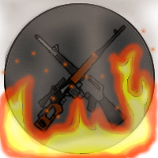

# **2D Game - Ninja Warfare**

 

## **Overview**

Welcome to **Ninja Warfare**, a thrilling 2D shooter game designed to deliver an immersive experience filled with action, customization, and strategic gameplay. This project incorporates a variety of game modes, extensive customization options, and exciting mechanics that aim to push the boundaries of multiplayer gaming.

---

## **Key Features**

- **Multiplayer Action**: Engage in exciting battles with friends or players from around the globe in a variety of game modes.
- **Extensive Customization**: Modify weapons, outfits, and special items to create a truly unique experience tailored to your playstyle.
- **Diverse Game Modes**:
  - **Deathmatch**: Fast-paced battles lasting 6 to 15 minutes (customizable).
  - **Team Deathmatch**: Strategic team-based combat with additional features.
  - **FFA (Free-for-All)**: A larger map designed for longer matches without kill limits.
  - **Capture the Flag (CTF)**: Classic CTF gameplay with a modern twist.
  - **Last Man Standing**: Survive until the end in maps with shrinking zones.
  - Additional modes coming soon!

---

## **Gameplay Mechanics**

### **Weapons & Customization**:
- **Variety of Weapons**: From WW2 classics to modern and futuristic weapons (e.g., plasma, laser weapons).
- **Modifiable Gear**: Customize weapons with scopes, sights, handles, magazines, and unique mods (e.g., increased range or reduced fire rate).
- **Armor Types**: 
  - **Light**: Fast movement, least protection.
  - **Medium**: Balanced protection and mobility.
  - **Heavy**: Maximum protection, reduced mobility.
  - **None**: No protection, no mobility penalties.

---

### **Special Items**:
- **First Aid Kits**: Heal 120% of health in 3 seconds.
- **Energy Drinks**: Quickly refill stamina (e.g., 80% in 1 second).
- **Painkillers**: Reduce damage taken by 25% for 5 seconds.
- **Ammo Boxes**: Carry additional ammo (e.g., 50% increase).

---

### **Gameplay Features**:

- **Respawn System**: 10-second respawn time with customizable pre-selected weapons and gear.
- **In-game Options**: Adjust settings such as sound, chat filters, and gore without leaving the match.
- **Movement**: Includes running, jumping, sprinting, rolling, and dodging with stamina mechanics.

---

### **Fair Play and Community Features**:

- **Custom Lobbies**: Always unranked to avoid abuse.
- **Cheat Detection**: Strict suspension system for cheaters and toxic players.
- **Clans**: Create and manage clans with Leader, Captain, and Sergeant roles. Clan wars and banners supported!

---

## **Gameplay Modes**

1. **Deathmatch**: Fast and furious solo or team-based battles with dynamic gameplay.
2. **Team Deathmatch**: Strategic team play with complex objectives.
3. **Free-for-All (FFA)**: A large map, unlimited chaos.
4. **Capture the Flag (CTF)**: Classic map control with team-based flag captures.
5. **Last Man Standing**: Survive until the last player remains with a shrinking zone.

---

## **Gold and Achievements**

Gold is earned through gameplay:
- **Kills**: Earn 1 gold per kill.
- **Deathmatch Wins**: 25 gold for a win with at least 20 kills.
- **CTF**: 15 gold for scoring a flag, with specific lobby requirements.
- **TDM**: 20 gold for each winning team member scoring above 10 kills.
- **LMS**: 40 gold for the Last Man Standing winner.

Achievements grant unique outfits, from simple wins to specific challenges such as scoring flags or completing levels in a given timeframe.

---

## **Game Development Notes**

- **Weapon Balance**: Extensive testing is required for weapon balance due to a wide variety of ideas.
- **Progression System**: Simple XP system where levels are based on cumulative experience needed for the next level (e.g., 1000 -> 1200 -> 1440).

---

## **Contact & Contribution**

- **GitHub**: [UZBeKHalilov](https://github.com/UZBeKHalilov)
- **Email**: khalilov8841@gmail.com
- **Contributions**: Fork the repository and create a pull request for feature additions or fixes!
